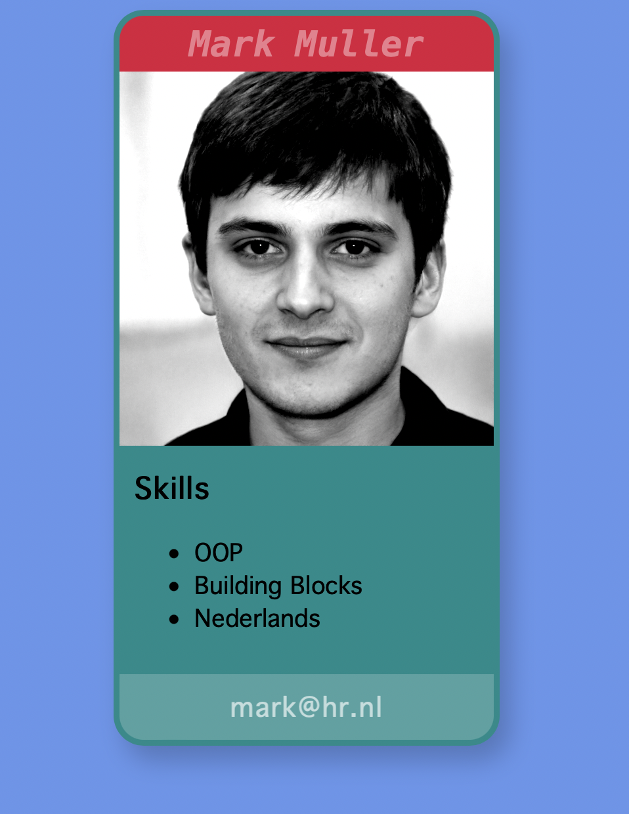

# Week 4 Uitwerking

In week 4 gaan we de overstap maken van Codepen naar local development, en we zetten onze site op github.

## Bespreken:

- Waaruit bestaat een website
- Wat betekent "hosting" van een website

## Van Codepen naar Local Development:

- [Installeren Visual Studio Code](https://code.visualstudio.com/download)
- [Installeren live server](https://marketplace.visualstudio.com/items?itemName=ritwickdey.LiveServer)
- `index.html` aanmaken en openen in VS Code.
- Verschil tussen inline style `<div style="...">`, de `<style>` tag, en `style.css` file.
- `index.html` openen in *Live Server*
- De default html maken met `!` (of `html:5`) shortcut. 
- Codepen overzetten naar lokaal

## Uploaden naar Github Pages

- Een github account maken en een repository maken
- Files op github plaatsen via upload button
- Github pages aan zetten
- Begin maken met het portfolio

<br>
<br>
<br>

# Lokaal ontwikkelen met Visual Studio Code

Als je Visual Studio Code hebt gedownload kan je lokaal gaan ontwikkelen! Je begint altijd met een leeg `index.html` bestand en een leeg `style.css` bestand.

In VS Code kan je een standaard html document aanmaken door in je bestand `html:5` of `!` te typen en op tab te drukken.

Je kan dan vervolgens je CSS file toevoegen via de `link rel` tag. Je html gaat er dan als volgt uit zien:

```html
<!DOCTYPE html>
<html lang="en">
<head>
    <meta charset="UTF-8">
    <meta http-equiv="X-UA-Compatible" content="IE=edge">
    <meta name="viewport" content="width=device-width, initial-scale=1.0">
    <title>Mijn portfolio</title>
    <link rel="stylesheet" href="./style.css">
</head>
<body>
    
</body>
</html>
```
Een html file moet altijd deze elementen bevatten:
- `<!DOCTYPE html>` zorgt dat het document als moderne html wordt gelezen
- `<meta name="viewport">` zorgt dat document goed schaalt op mobiel
- `charset UTF-8` zorgt voor ondersteuning van talen, symbolen en emoji 🤟
- `<html lang="en">` zorgt dat de browser snapt in welke taal je content is
- `<title>` wordt getoond bovenin je browservenster en in favorites/history
- `<meta http-equiv="X-UA-Compatible" content="IE=edge">` is voor compatibility met oudere browsers, dit kan je weg laten.
<br>
<br>
<br>

## html, head, body

Vergeleken met codepen zijn er nu drie tags bij gekomen. De `html` tag bevat je gehele document. De `head` tag bevat `meta` informatie. Dit wordt niet getoond in de browser maar is wel belangrijk voor de weergave. Hier kan je ook je CSS inladen.

In de `<body>` tag plaats je al je HTML die we ook in CodePen hadden gemaakt. Je CSS code komt in een eigen `style.css` bestand te staan.

<br>
<br>
<br>

## Web server

Een online website wordt gehost op een web server. De server bevat alle content, zoals html files, plaatjes en css files. Een webadres begint altijd met `https://`. Zodra je een website bezoekt worden die bestanden gedownload en gerenderd in je browser.

<br>
<br>
<br>

## Localhost

Als je een `index.html` aan het ontwikkelen bent op je eigen computer, en je opent deze door er dubbel op te klikken, dan opent het bestand wel in een browser, maar nu staat er `file://` in plaats van `http://` in de adresbalk 🧐.

⚠️ *Dit zorgt voor security issues bij het laden van afbeeldingen of andere content!* Om dit te voorkomen werken we met de [live server](https://marketplace.visualstudio.com/items?itemName=ritwickdey.LiveServer) extensie. Deze opent `index.html` in een tijdelijke web server. Dit kan je zien doordat er nu `http://localhost` in je adresbalk staat. 

Live server houdt in de gaten of jij je HTML of CSS aanpast. Als dat zo is, wordt de browser automatisch verversd.

> 👍 http://localhost:1234/index.html

> 🚫 file://c:mijn documenten/programmeren/week3/index.html

<br>
<br>
<br>

> 🕵️‍♀️ *Geheime tip: als je wil dat de localhost altijd aan staat voor een bepaalde map, ook als je visual studio code hebt afgesloten, dan kan je de [servez](https://greggman.github.io/servez/) app downloaden. Nu kan je altijd naar `http://localhost` gaan om je site te bekijken.*

<br>
<br>
<br>

## Opdracht

Zet je codepen oefeningen over naar een lokale website in visual studio code!

<br>
<br>
<br>

# Github

Als je een github account hebt aangemaakt, kan je voor je portfolio project een nieuwe repository aanmaken. ⚠️ Geef je repository een duidelijke naam, want dit wordt ook je URL!

Vervolgens klik je binnen die repository op de `code` tab, en dan op de button ***upload file***. Kies nu voor je `index.html` en `style.css`. 

Als dit is gelukt ga je naar `settings > pages` en klik vervolgens op `publish page > main` en druk op `save`. Als alles goed gaat, staat je website nu live!

### Aanpassen

Als je een aanpassing hebt gedaan, die goed werkt in je `localhost`, dan kan je via `upload file` de bestanden weer uploaden naar je repository.

<br>
<br>
<br>


## Oefening

Maak onderstaande screenshot na met de HTML/CSS technieken die je tot nu toe hebt geleerd. 

- Maak een block element dat gecentreerd op de pagina staat.
- Plaats daarbinnen vier block elementen onder elkaar waarin de content komt.

> *TIP: als je nog niet weet welke semantische tags handig zijn gebruik je het `<div>` element.*


## Puntjes op de i

Maak het helemaal af door `box-shadow, 
corner-radius` en `overflow-hidden` op je container element toe te passen.



<br>
<br>
<br>

# Inleveropdracht

Deze week maak je de eerste inleveropdracht op [FeedbackFruits](https://feedbackfruits.com). Dit is onderdeel van je beoordeling.

<br>
<br>
<br>

## Links

- [Maak een account aan op github.com](https://github.com/)
- [Download Visual Studio Code](https://code.visualstudio.com/download)
- [Live Server (bekijk je site in een localhost server)](https://marketplace.visualstudio.com/items?itemName=ritwickdey.LiveServer)
