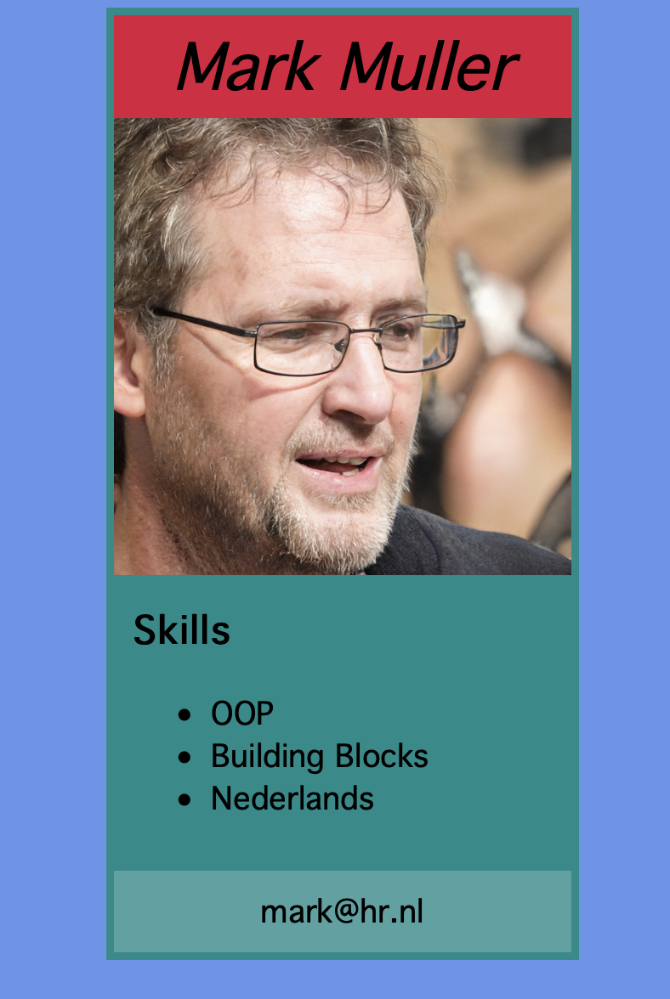
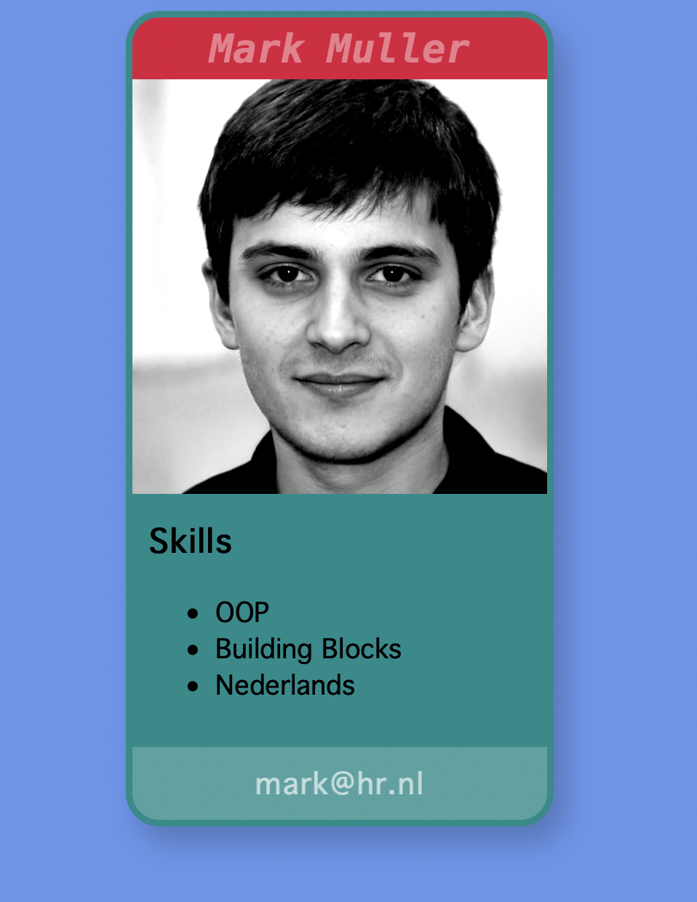

# Week 4

In week 3 gaan we de overstap maken van Codepen naar local development, en we zetten onze site op github.

## Bespreken:

- Waaruit bestaat een website
- Wat betekent "hosting" van een website

## Van Codepen naar Local Development:

- Installeren Visual Studio Code
- Installeren live server
- index.html en style.css aanmaken en openen. Verschil tussen inline style en losse stylesheet.
- De default html maken met ! shortcut. Bekijken wat hier in staat.
- Codepen overzetten naar lokaal

## Uploaden naar Github Pages

- Een github account maken en een repository maken
- Files op github plaatsen via upload button
- Github pages aan zetten
- Begin maken met het portfolio

 
 
 

## Oefening

Maak onderstaande screenshot na met de HTML/CSS technieken die je tot nu toe hebt geleerd. 

- Maak een block element dat gecentreerd op de pagina staat.
- Plaats daarbinnen vier block elementen onder elkaar waarin de content komt.

> *TIP: als je nog niet weet welke semantische tags handig zijn gebruik je het `
` element.*

## Puntjes op de i

- Experimenteer met [box-shadow](https://www.cssmatic.com/box-shadow), 
[corner-radius](https://www.w3schools.com/css/css3_borders.asp) en [overflow-hidden](https://www.w3schools.com/css/css_overflow.asp) op de container.
- Maak de font kleuren een lichtere of donkerder tint dan de achtergrondkleur.
- Speel met [filter](https://divisoup.com/how-to-use-css3-filters-to-create-captivating-images/) op de afbeelding.

 
 
 

# Inleveropdracht

Deze week maak je de eerste inleveropdracht op [FeedbackFruits](https://feedbackfruits.com). Dit is onderdeel van je beoordeling.