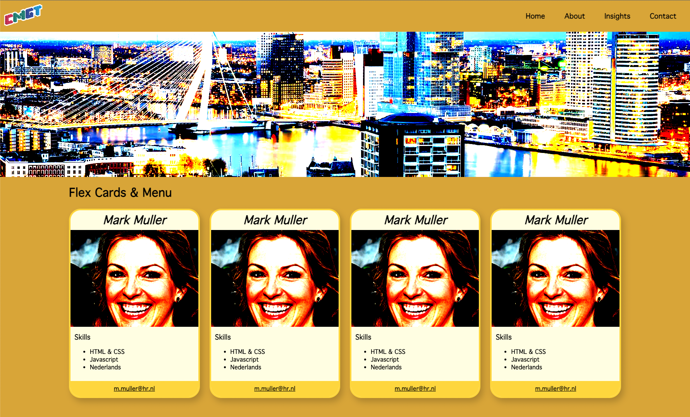

# Week 5 Uitwerking

In deze week gaan we kijken naar een magische CSS trick: de FLEX box, en we gaan werken met afbeeldingen.

## Onderwerpen:

- Flex box gebruiken voor een rij *of* kolom van block elementen
- Navigatie bar maken met flex
- Images naast elkaar zetten met flex
- Image object fit gebruiken om vervorming tegen te gaan
- Background image gebruiken voor header / hero
- Figure tag voor captions
- Lazy loading

## Oefening

- Student cards
- Nav bar met logo

<Br>
<br>
<br>

# Cheat sheet

<a href="./images/flex-poster-large.png"></a>

<br>
<br>
<br>

# Flex

We hebben tot nu toe onze layout gemaakt met `block` elementen zoals `section` en `div`. We hebben gezien dat een block element smaller kan zijn dat het scherm, bv. met `width:60vw`. 

Onze block elementen bleven echter wel telkens *onder elkaar* staan. Met `flex` kunnen we de blokken *naast elkaar* zetten.

> 🛟 *`flex` vervangt het werken met `float` en `inline-block`!*

<br>
<br>
<br>

## Flex parent

Door een element op `display:flex` te zetten, wordt het een `block` element, EN het gaat alle `block` children NAAST elkaar zetten.

De parent bepaalt ook hoeveel ruimte er tussen de children komt te staan, en of de children links, rechts of gecentreerd worden uitgelijnd, met `justify-content`.

> [Hou altijd deze cheat sheet bij de hand!](https://css-tricks.com/snippets/css/a-guide-to-flexbox/)

HTML

```html
<section>
    <div>Een kolom</div>
    <div>Dit is ook een kolom</div>
    <div>Hee, hier is nog een kolom</div>
</section>
```
CSS
```css
body {
    margin:0;
    background-color:grey;
    font-family:sans-serif;
}
section {
    display:flex;
    justify-content:space-between;
}
```

<br>
<br>
<br>

## Flex Children

Je ziet dat de divs binnen de section zo breed zijn als nodig is voor de content binnen de div. Het is mooier als de drie kolommen elk 1/3 van de breedte van de pagina innemen. Dit doe je met `flex:1`.

```css
section div {
    background-color:white;
    flex:1;
}
```

<br>
<br>
<br>

### Flex grow, shrink, basis

De term `flex:1` is een afkorting voor `flex-basis:0; flex-grow:1`. Er is een derde optie: `flex-shrink`. Bekijk op onderstaande links wat deze opties doen.

- `flex-basis:50px` gebruik je om het block element een startafmeting te geven. Hiervoor kan je `px`, `vw` of andere CSS units gebruiken. [Bekijk deze demo om te zien wat hier mee bedoeld wordt](https://developer.mozilla.org/en-US/docs/Web/CSS/flex-basis). Deze afmeting kan nog steeds wel groeien of krimpen. Als je dat niet wil kan je `width:50px` gebruiken om de breedte vast te zetten.
- `flex-grow:1` betekent dat het block element meegroeit in een gelijke verhouding met de andere block elementen. [Bekijk deze demo om te zien wat hier mee bedoeld wordt](https://developer.mozilla.org/en-US/docs/Web/CSS/flex-grow)
- `flex-shrink:1` betekent hoeveel dit block element mag krimpen als er niet genoeg ruimte beschikbaar is. [Bekijk deze demo om te zien wat hier mee bedoeld wordt](https://developer.mozilla.org/en-US/docs/Web/CSS/flex-grow)

<br>
<br>
<br>

## Flex gebruiken voor afbeeldingen

In dit voorbeeld plaatsen we drie afbeeldingen naast elkaar met flex. We gaan hierbij ook een aantal problemen oplossen waar je vaak mee te maken krijgt: 

- afbeeldingen hebben vaak niet dezelfde verhouding (staand, liggend, 16:9, 4:3)
- als je een afbeelding een vaste maat geeft (bv. 400px bij 300px) dan wordt de afbeelding uitgerekt of ingedrukt.

Je kan je eigen afbeeldingen gebruiken, of random afbeeldingen ophalen via :

- unsplash ``
- cat as a service: ``

### Afbeelding resolutie

Let op de resolutie en de filesize van je afbeelding! Deze moeten snel te downloaden zijn. Je kan je afbeeldingen verkleinen via [Tiny PNG](https://tinypng.com)

<br>
<br>
<br>

HTML

We plaatsen de afbeeldingen BINNEN een div. De reden is dat de DIV nog steeds mooi geschaald wordt via FLEX. De afbeelding past hier wellicht niet in *(omdat afbeeldingen allerlei formaten kunnen hebben)*, maar dit kunnen we oplossen door te zeggen dat een afbeelding `100%` van een parent moet innemen. 

```html
<section>
    <div></div>
    <div></div>
    <div></div>
</section>
```
CSS
```css
section div img {
    width:100%;
}
```
De afbeeldingen passen nu mooi in de drie kolommen, maar zijn niet even hoog. Je kan de images een vaste hoogte geven, bijvoorbeeld met `40vh` *(40 procent van de hoogte van het scherm)*. 

Probeer dit uit! Je ziet nu dat de afbeeldingen wel even hoog zijn, maar vervormd worden.
```css
section div {
    background-color:white;
    flex:1;
}
section div img {
    width:100%;
    height:40vh;
}
```
Dit gaan we oplossen met `object-fit`. Deze eigenschap zorgt dat de afbeelding niet vervormd wordt:

- **contain**: De afbeelding wordt verder verkleind zodat deze helemaal past. Er komt extra witruimte om de afbeelding heen.
- **cover**: De randen van de afbeelding worden afgesneden totdat de afbeelding precies in de container past.

```css
section div img {
    width:100%;
    height:40vh;
    object-fit:cover;
}
```
<br>
<br>
<br>

# Nav bar met flex

Omdat buttons in een `<nav>` balk naast elkaar staan, kunnen we hier ook `flex` gebruiken. Traditioneel wordt vaak een `<ul><li>` structuur in de navigatie gebruikt. We kunnen het onszelf makkelijk maken door de `<a>` links in de `<nav>` bar te veranderen in `block` elementen.

HTML
```html
<nav>
  <a href="#">about cats</a>
  <a href="#">more about cats</a>
  <a href="#">everything about cats</a>
</nav>
```
CSS
```css
nav {
  display: flex;
  justify-content: space-between;
}
nav a {
  display: block;
  flex: 1;
  text-align: center;
  background-color: lightblue;
}
nav a:hover {
  background-color: darkblue;
  color: white;
}
```


> *[Vóór het bestaan van FLEX werden navigatie items vaak met `<ul>` en `<li>` items gemaakt. Het nadeel hiervan is dat je alle standaard styling van die lists eerst moet verwijderen](https://css-tricks.com/navigation-in-lists-to-be-or-not-to-be/)*

<br>
<br>
<br>

# Hero image

Veel websites gebruiken een grote hero image. We hebben met `object-fit` gezien hoe je kan zorgen dat een afbeelding altijd mooi meeschaalt met de browser. Het nadeel van een `` tag is dat je er niet makkelijk tekst overheen kan zetten. 

Om elementen met content én een achtergrondafbeelding te maken gebruik je `background-image`. Deze image kan je ook met `cover` of `contain` laten schalen. Het middelpunt van schaling bepaal je met `background-position`.

### Tekst verticaal centreren

In dit voorbeeld gebruiken we meteen een `hack` van de `flex` eigenschap: door `flex direction` op `column` te zetten, komen je flex items onder elkaar te staan *(net zoals bij display:block)*. Echter kan je nu ook aangeven dat de items verticaal gecentreerd moeten worden!

```html
<header>
    <div>Cat gallery</div>
</header>
```
```css
header {
  height:30vh;
  display:flex;
  flex-direction:column;
  justify-content:center;
  align-items:center;
  font-size:2em;
  color:white;
  font-weight:bold;
  background-image: url(https://images.unsplash.com/photo-1547841243-eacb14453cd9);
  background-size:cover;
  background-position:bottom;
}
```
<br>
<br>
<br>

## Figure en caption

Je kan je `` tags binnen een `<figure>` tag plaatsen. Dit doen we om een `<figcaption>` onder het plaatje te kunnen zetten. Voor screenreaders *(voor mensen met een visuele beperking)* moet je ook een `alt` waarde aan je `img` geven.

```html
<section>
    <div>
        <figure>
               
          <figcaption>Cute cat</figcaption>
        </figure>
      </div>
    <div>
        <figure>
          
          <figcaption>Angry cat</figcaption>
        </figure>
       </div>
    <div>
        <figure>
          
          <figcaption>Hungry cat</figcaption>
        </figure>
    </div>
</section>
```


<br>
<br>
<br>

## Lazy loading

Laad een afbeelding pas als de gebruiker er naartoe scrollt.

```html

```
<br>
<br>
<br>

# Oefening:

## Cards

In [week 4](./week4.md) heb je een student card gemaakt. Plaats nu meerdere student cards naast elkaar zoals in onderstaand voorbeeld. 


> *Als niet alle kaartjes even hoog zijn, kan je [align-items](https://css-tricks.com/snippets/css/a-guide-to-flexbox/#aa-align-items) gebruiken.*

> *Je kan random avatars als volgt laden: ``*

<br>
<br>
<br>

## Nav Bar

Maak onderstaande navigatie balk na. Het logo staat links. De buttons staan tegen de rechterkant. ⚠️ *Het stuk tussen het logo en de buttons schaalt mee met het scherm.*


> *Tip: je kan flex items een vaste breedte geven met `width`.*

<br>
<br>
<br>

## Eindresultaat

Combineer de *nav bar*, *card row* en *hero image* tot één geheel. 



<br>
<br>
<br>

# Links

- [CSS Tricks Flexbox Guide](https://css-tricks.com/snippets/css/a-guide-to-flexbox/)
- [Flex justify content](https://developer.mozilla.org/en-US/docs/Web/CSS/justify-content)
- [Flex shorthand](https://developer.mozilla.org/en-US/docs/Web/CSS/flex)
- [Flex basis](https://developer.mozilla.org/en-US/docs/Web/CSS/flex-basis), [flex grow](https://developer.mozilla.org/en-US/docs/Web/CSS/flex-grow) en [Flex shrink](https://developer.mozilla.org/en-US/docs/Web/CSS/flex-grow)
- [Codepen voorbeeld Cat Gallery](https://codepen.io/eerk/pen/rNdWjKR)
- [Tiny PNG](https://tinypng.com)
- Maak random avatar links : `https://randomuser.me/api/portraits/men/41.jpg`
