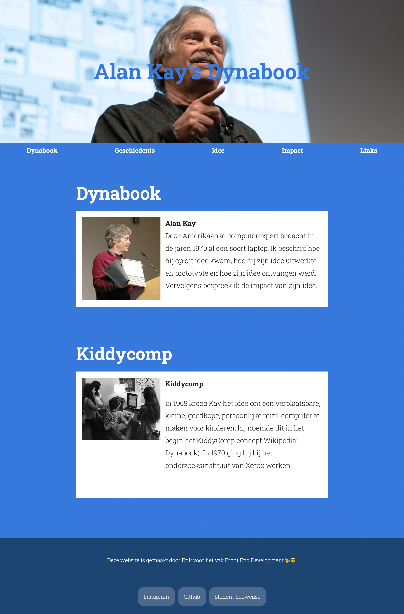
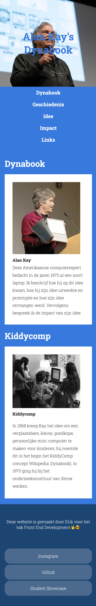
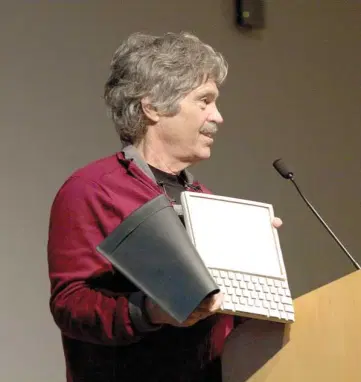
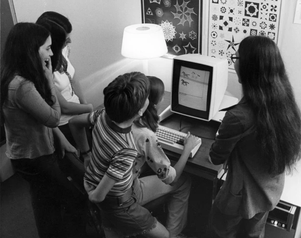
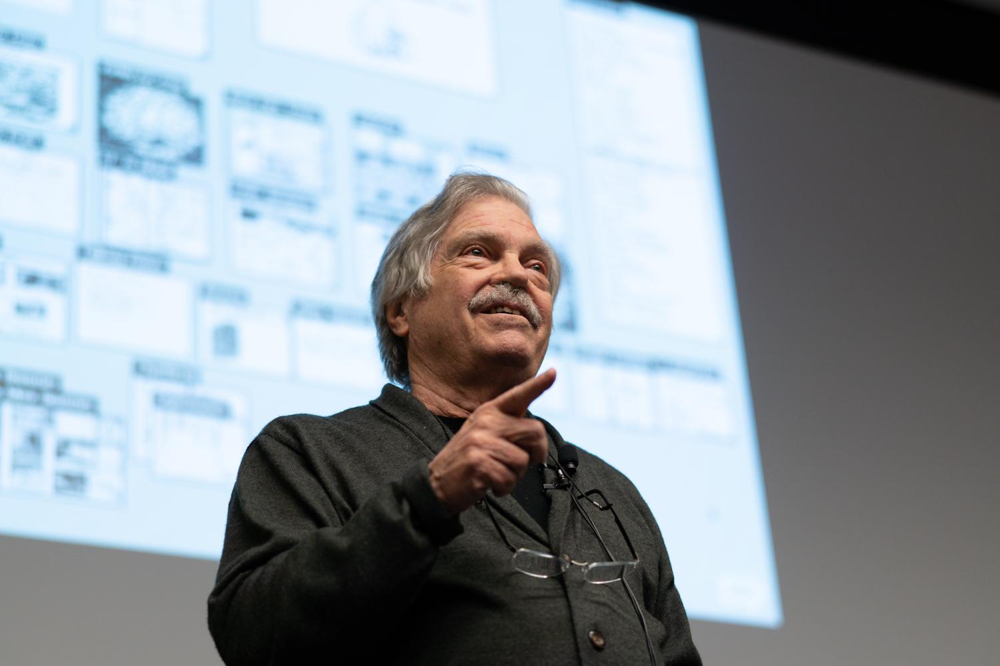

# Week 6

Deze week gaat het over mobile. Wat is ontwerpen voor mobile? Hoe maak je een site geschikt voor verschillende schermafmetingen?

Onderwerpen:

- Mobile First
- Meta Resize Tag
- Responsive mode aanzetten in de browser
- Layout tips met flex, vw en % units
- @media queries en breakpoints voor phone, tablet, desktop
- nav items onder elkaar zetten op mobiel
- een horizontal scroller maken op mobiel

 
 
 

## Oefening

Je ziet hieronder een webdesign dat jij als webdeveloper aangereikt krijgt van de designer. Er is een versie voor desktop en een versie voor mobile. ***Aan jou de taak om met HTML en CSS dit ontwerp zo accuraat mogelijk te bouwen!***

Maak de navigatie balk werkend. De knoppen springen naar een andere HTML pagina of naar een andere plek in je document.

*Klik met rechts op de afbeeldingen om ze te vergroten*.

| Desktop          | Mobile     |
| --------------- | --------------- |
|  |        |

Je kan de drie benodigde afbeeldingen hier vinden:

| Afbeeldingen |  |  |
| ----------- | ----------- | ----------- |
|  |  |  |

 
 
 

## FeedbackFruits inleveropdracht

Zorg ervoor dat je de lesonderwerpen t/m week 1.6 hebt verwerkt in jouw eigen CLE portfolio website. Maak de opdracht in Feedbackfruits week 6.